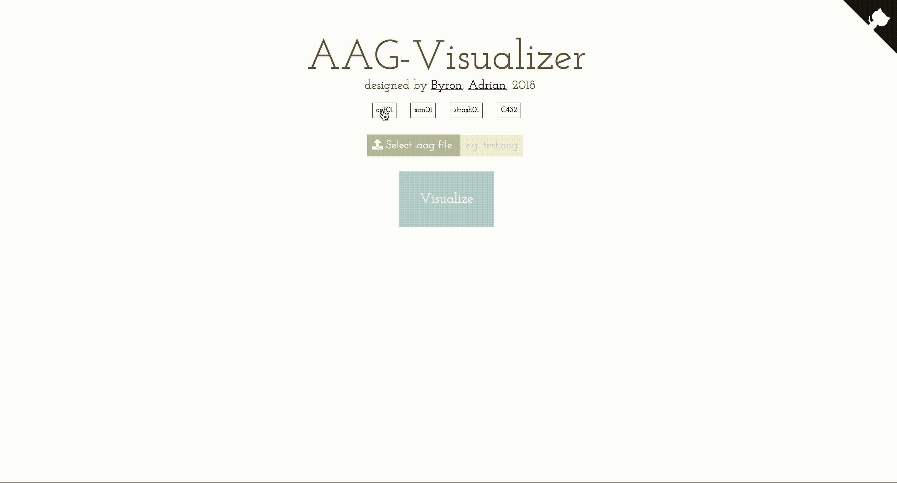
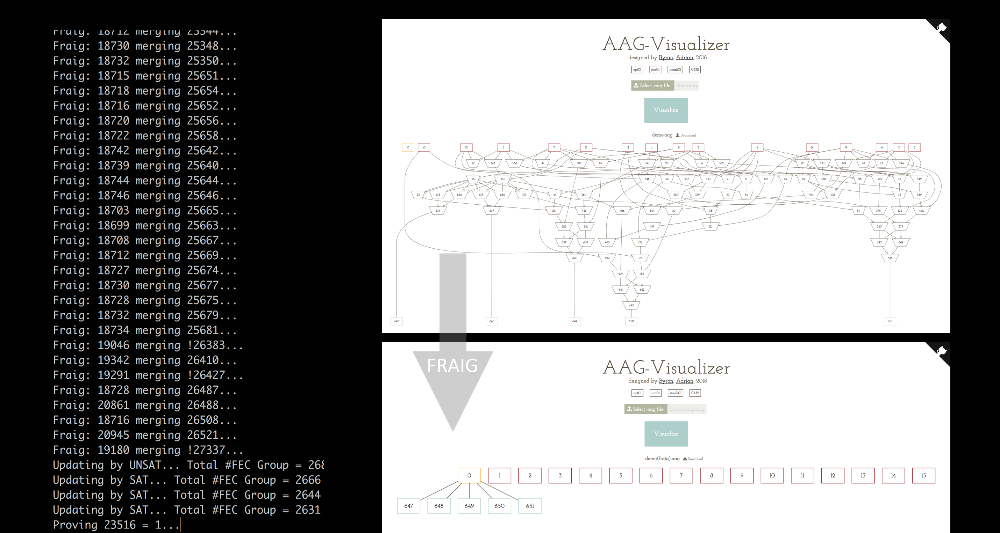
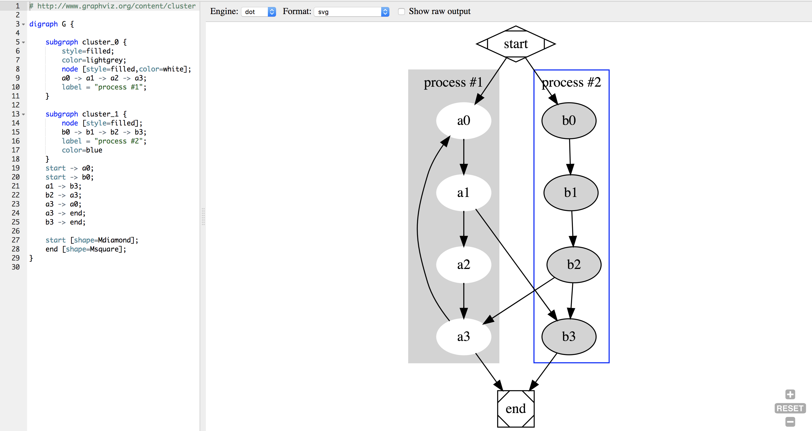
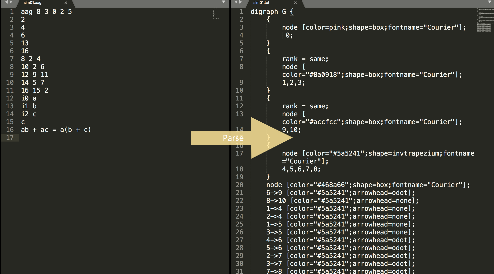
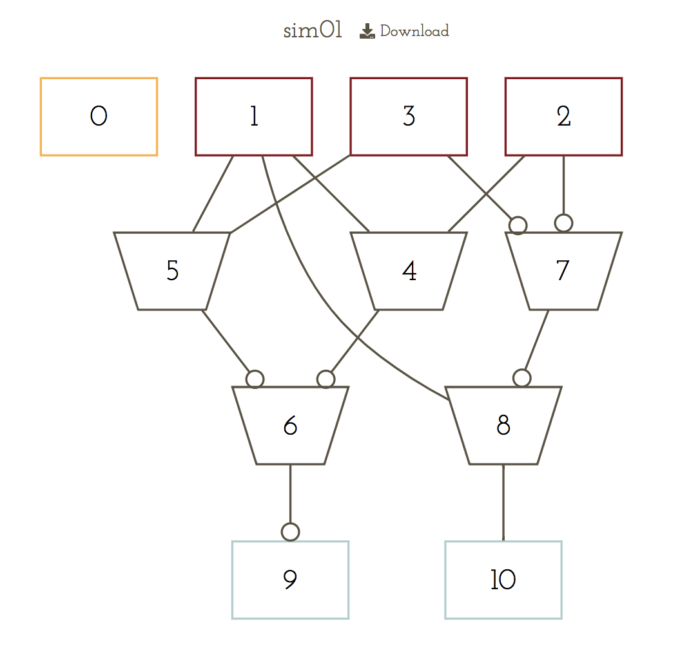
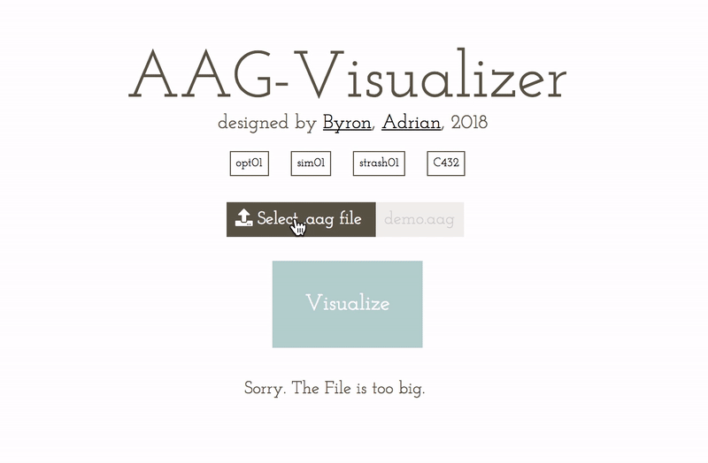

# A complete guide to build your own visualizer using viz.js and animate.css!

> You can visualize any graph with pure javascript！
> This tutorial is not specific to visualize circuit, it can be applied to any graph you want.



**What is** [AAG-Visualizer](https://byronhsu.github.io/AAG-Visualizer/)? What can it do?
It is an elegant visualizer which can convert complex circuit format like [AIGER](http://fmv.jku.at/aiger/) (hard to understand to human) into simple and pretty svg with just one click. 
> Inspration
> Final project【Fraig】of **Data Structure and Programming** (held by Ric Huang) In National Taiwan University Electrical Engineering Department

## A brief introduction of Fraig and AAG

### What does FRAIG do?

<p align="center">

</p>

Functionally Reducing And-Inverter Graph

### What is AAG?
Check [Brief Guide of Aiger Formot](https://gist.github.com/ByronHsu/aebde44a3f7d1b45ffc721af95d80234) by my friend, Hanmo Ou.

*You don't need to understand it thoroughly. What you need to know is that it is just a format of And-Invertor Graph.*


> ### Ok, so let's get into the topic. How did I convert aag to svg on the frontend side?


## Application Structure


```c++
.
├── .gitignore
├── README.md
├── package.json
├── public
│   ├── bundle.js
│   ├── index.html
│   └── assets/
├── server
│   ├── config.js
│   └── server.js
├── src
│   ├── assets
│   ├── js
│   │   └── animate.js
│   │   └── parser.js
│   ├── scss
│   │   └──  index.scss
│   ├── index.js
│   └── template.html
├── webpack.dev.config.js
└── webpack.prod.config.js
```

### Viz.js

[official docs](https://github.com/mdaines/viz.js)

<p align="center">

</p>

#### Brief Introduction of Viz.js
This project is a Makefile for building Graphviz with Emscripten and a simple wrapper for using it in the browser. A super fast and convenient way to draw graphs on the browser.

- Install

```sh
npm install viz.js
```

- Basic Usage in javascript

```js
// format of .dot
var digraph = 'digraph { a -> b; }';

//for svg
var svgXml = Viz(digraph, { format: "svg"});
document.body.innerHtml = svgXml;

//for img-element
var img-element = Viz(digraph, { format: "png-image-element"});
document.body.append(img-element);	 
```

- Customization

What's more? You can customize the node color, the vertex width...etc on the graph.
Just roll up your sleeves and change the style at your will. 
See the docs [here](https://www.graphviz.org/documentation/).


**Nothing else! It is just that easy.
Now we only need to parse our input into .dot file.
And we can see our string magically turns into pretty svg circuit!**

#### Parser

- parser.js

Use the mightiness of regexp in javascript.You can parse anything with ease.
Check out this fantastic tutorial!
[JavaScript: Learn Regular Expressions for Beginners](https://codeburst.io/javascript-learn-regular-expressions-for-beginners-bb6107015d91)
> Best js regexp tutorial I have ever seen.

In view of different input format should have their own parser. I skip the part of discussing how to parse them. But I believe that if you can use regexp well. It is really not a big deal.

<p align="center">

</p>


```js
//parser.js
function parser(args...){
}
export default parser;
```

#### Combine

```js
import parser from './js/parser.js'

// format of .dot
var digraph = parser(data);

//for svg
var svgXml = Viz(digraph, { format: "svg"});
document.body.innerHtml = svgXml;

//for img-element
var img-element = Viz(digraph, { format: format: "png-image-element"});
document.body.append(img-element);	
```

<p align="center">

</p>

**Enjoy the fantastic fancy graph you make!**

### animate.css
[official docs](https://github.com/daneden/animate.css)

#### Brief Introduction of animate.css

A super easy library to make fantastic animation on dom object.

- Install

```html
<head>
  <!-- animate.css -->
  <link rel="stylesheet"
	  href="https://cdnjs.cloudflare.com/ajax/libs/animate.css/3.5.2/animate.min.css">
  <!-- jquery -->
  <script
	src="https://code.jquery.com/jquery-3.1.1.min.js"
	integrity="sha256-hVVnYaiADRTO2PzUGmuLJr8BLUSjGIZsDYGmIJLv2b8="
	crossorigin="anonymous"></script>
</head>
```
- Basic Usage

```js
// animate.js
$.fn.extend({
    animateCss: function (animationName, callback) {
        var animationEnd = 'webkitAnimationEnd mozAnimationEnd MSAnimationEnd oanimationend animationend';
        this.addClass('animated ' + animationName).one(animationEnd, function() {
            $(this).removeClass('animated ' + animationName);
            if (callback) {
              callback();
            }
        });
        return this;
    }
});

// index.js
// load animate.js in advance for repeated animation
import './js/animate.js'
document.getElementById('container').animateCss('shake');

```

#### Implement

> My goal is to add "shake" animation on visualize button when the format is wrong.
> And add "squeeze" animation on it when it is visualized successfully.

**How to do?**
It is unbelievably easy!
You don't need to write a lot of keyframes and annoying thing.
Just call `animateCss` and the magic happen.

- Visualize Button

```js
// index.js
function handleFileSelected(event) {
	...
	if(input.files.length === 0) { // no file in <input>
		$('#btn').animateCss('shake');
		return;
	}else
	if(!/.aag/g.test(input.files[0].name)){ // format is wrong
		$('#btn').animateCss('shake');
		return;
	}
	...
	// Right format and ready to visualize
	$('#btn').animateCss('rubberBand');
}
document.getElementById('btn').addEventListener('click', handleFileSelected);
```



**Write 10 lines of code but impress all the user who step into your website.
Why not?** 

❤ If this post was helpful, please hit the little heart!

And don’t forget to give a star to my repo  🎉 ✨ [AAG-Visualizer](https://github.com/ByronHsu/AAG-Visualizer)
Any PR and Issue is welcome!

You can clone from Github. Upload any .aag file in the example folders and wait the magical change. Hope you enjoy!

```
git clone https://github.com/ByronHsu/AAG-Visualizer.git
```
